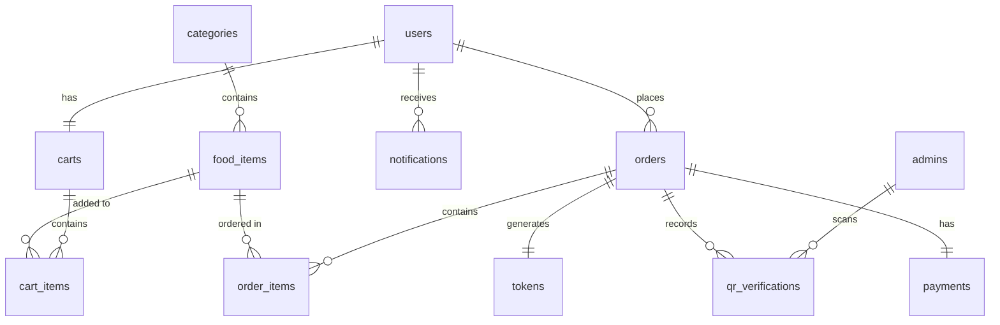

# Smart Canteen Management System - Database Schema

This document details the relational schema models defined inside the Flask application.

---

## 🗄️ Database Tables Overview

### 1. `users` (Students)
* Stores student profiles, Year, Department details, and password signatures.
* **Relations**: One-to-One Cart, One-to-Many Orders, One-to-Many Notifications.

### 2. `admins` (Canteen Staff)
* Stores admin panel credentials and system roles (`admin`, `super_admin`).
* **Relations**: One-to-Many QRVerifications.

### 3. `categories`
* Organizes food items (Breakfast, Lunch, Snacks, etc.).
* **Relations**: One-to-Many FoodItems.

### 4. `food_items`
* Food catalog details, stock quantity, veg tags, and popularity counters.
* **Relations**: Many-to-One Category.

### 5. `carts` & `cart_items`
* Manages user items queued before checking out.
* **Relations**: Many-to-One User, Many-to-One FoodItem.

### 6. `orders` & `order_items`
* Ordered tickets. Order ID matches pattern `ORD-YEAR-NUMBER` (e.g. `ORD-2026-000104`).
* **Relations**: One-to-One Token, One-to-One Payment.

### 7. `payments`
* Order payment status (Paid, Pending, Failed).
* **Relations**: One-to-One Order.

### 8. `tokens`
* Unique collection codes like `TKN-384`. Includes JSON data string signed with HMAC-SHA256 verification hash.
* **Relations**: One-to-One Order.

### 9. `qr_verifications`
* Scan results log containing timestamp, admin scanner ID, and scan state (verified, duplicate, failed) to avoid double collections.

---

## 🗺️ Entity Relationship (ER) Diagram

